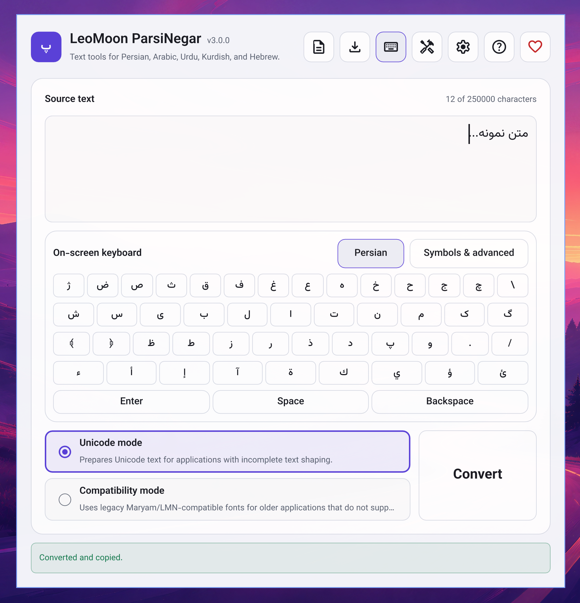
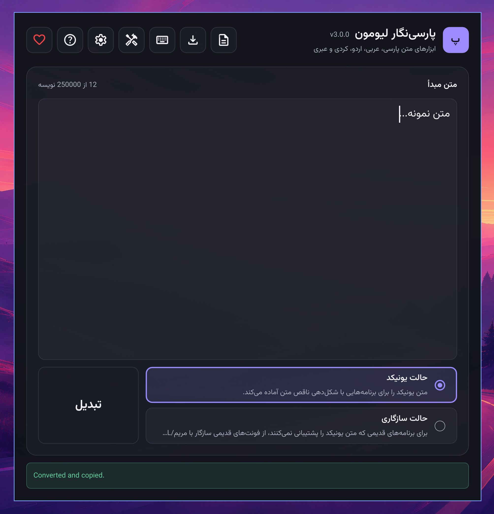
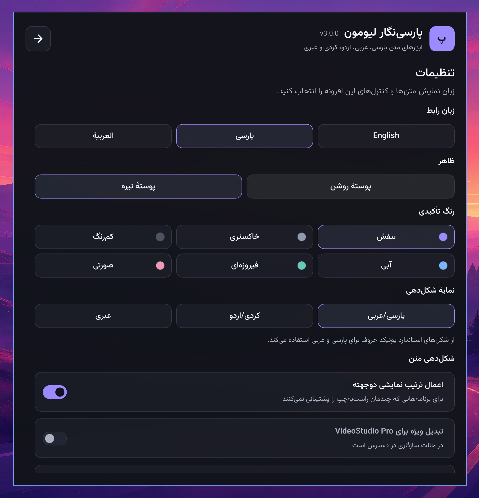

# LeoMoon ParsiNegar

## Introduction

> Without a free and easy way to type, Persian culture cannot advance.

LeoMoon ParsiNegar is a free, open-source desktop application for preparing Persian, Arabic, Urdu, Kurdish, and Hebrew text for other applications. It is especially useful when a graphics or video application does not shape right-to-left text correctly. Type or paste your text in ParsiNegar, convert it, and paste the result where you need it. You can also turn the text into editable SVG curves for designs that need to look the same even when the font is not installed on another computer.

Maintained since 2008, ParsiNegar has been rewritten for its current release as a cross-platform Qt 6 application. The rewrite makes the project easier to maintain, provides automated builds, and makes the source code available to everyone.

## Previews
ParsiNegar editor in English with the light theme


ParsiNegar editor in Persian with the dark theme


ParsiNegar settings page in Persian


ParsiNegar text tools page in Persian


## Features

- Unicode and compatibility conversion for applications with incomplete right-to-left support:
  - Unicode mode for applications that accept Unicode text but do not shape or order it correctly.
  - Compatibility mode for older applications that need legacy Maryam/LMN character codes and a matching compatibility font. The Hebrew profile uses Unicode mode only.
- A standalone editor with an on-screen keyboard, plain-text document saving, undo and redo, and tools for cleaning or changing source text.
- Font-specific SVG curve export with an installed-font selector, an on-demand preview, and warnings about missing glyphs.
- English, Persian, and Arabic interface languages, light and dark themes, and accent-color choices.
- Offline use on Windows, macOS, and Linux.

## Usage

1. Download the package for your computer from the [GitHub releases page](https://github.com/leomoon-studios/leomoon-parsinegar/releases). Windows has x64 and ARM64 installers, macOS has a universal DMG and PKG, and Linux has x86_64 and ARM64 AppImages. On Linux, make the AppImage executable before opening it.
2. Type or paste your original text into **Source text**. Use the **Document** menu to save it as a plain-text file if you want to keep a copy. You can also use **Text Tools** to clean or transform the source before conversion.
3. If needed, open **Settings** and choose the shaping profile for Persian and Arabic, Kurdish and Urdu, or Hebrew. Choose **Unicode mode** for a destination that accepts Unicode text, or **Compatibility mode** for an older destination that requires a matching LMN/Maryam-style font.
4. Click **Convert** or press `Ctrl+Enter`. ParsiNegar copies the converted text to your clipboard, ready to paste into the destination application. In compatibility mode, select the corresponding compatibility font in that application too; otherwise the pasted characters may not display as intended.

To create an SVG instead, enter your source text and open **Export SVG**. Select the conversion mode and a suitable font, adjust size, spacing, and alignment, then click **Preview** to inspect the result. Use **Update preview** after making changes. If the preview reports missing glyphs, choose another font before clicking **Save SVG**. SVG export creates curves, so the lettering remains visually consistent without requiring the font on the receiving computer.

The compatibility fonts are optional. The Windows and macOS installers offer font installation by default. Linux AppImages do not install fonts system-wide; Ubuntu users can install the separate font `.deb`, while users of other Linux distributions can use the font ZIP and its included instructions. You only need these fonts when using compatibility output or when you want to use them for SVG export.

## Keyboard shortcuts

- `Ctrl+Enter`: Convert
- `Ctrl+,`: Toggle Settings
- `Ctrl+T`: Toggle Text Tools
- `Ctrl+E`: Toggle Export
- `Ctrl+H`: Toggle Help
- `Ctrl+wheel`: Change editor text size (`Command+wheel` on macOS)

The Document menu also provides `Ctrl+N` (New), `Ctrl+O` (Open), `Ctrl+S` (Save), and `Ctrl+Shift+S` (Save As).

## Build

Requirements:

- CMake 3.21 or newer
- Qt 6.5 or newer with Core, Gui, Qml, Quick, Quick Controls 2, Quick Test, and Test development components
- A C++17 compiler supported by the selected Qt release
- Ninja is recommended but not required

From the repository root:

```sh
cmake -S . -B build -G Ninja -DCMAKE_BUILD_TYPE=Debug
cmake --build build
ctest --test-dir build --output-on-failure
cmake --build build --target parsinegar_ui_qmllint
```

Run the application with `./build/leomoon-parsinegar` on Linux, `open "build/LeoMoon ParsiNegar.app"` on macOS, or `.\build\leomoon-parsinegar.exe` on Windows. If CMake cannot find Qt, set `CMAKE_PREFIX_PATH` to the installed Qt directory. On Windows, configure from a Developer PowerShell matching the Qt compiler kit.

## Packaging

Release packaging is platform-specific. Linux provides x86_64 and ARM64 AppImages, Windows provides x64 and ARM64 Inno Setup installers, and macOS provides universal Intel and Apple Silicon DMG and PKG packages. Linux compatibility fonts are available separately as an architecture-independent Ubuntu `.deb` or a ZIP for manual installation. Windows and macOS installers include checked-by-default options for installing the bundled compatibility fonts system-wide and creating a desktop shortcut. See the CMake packaging files and release workflow for platform prerequisites and signing options.

The bundled compatibility fonts are in `assets/fonts/system/`. Vazirmatn and Material Symbols are embedded for the application interface.

The Linux AppImages do not install the optional fonts system-wide. Ubuntu users can install the separate `leomoon-parsinegar-fonts-<version>-ubuntu-all.deb` package. Advanced users on other Linux distributions can extract `leomoon-parsinegar-fonts-<version>-linux-all.zip` and follow its `FONTS-README.txt` for manual installation. Both font packages contain the same LMN and LMU fonts; neither includes the application.

Pushing a tag in the exact `vX.Y.Z` form starts the release workflow. The workflow derives `metadata/VERSION` from the tag, writes the current UTC date to `metadata/RELEASE_DATE`, and then starts the separate Linux, Windows, and macOS builds. It publishes one GitHub Release only after every build and clean-install test succeeds. The release page includes a commit list, GitHub source archives, each native package as an individual download, and one combined `SHA256SUMS` file.

```sh
git tag v3.0.0
git push origin v3.0.0
```

### Manual test builds

The release workflow can also be started manually to build and test packages without creating a tag or publishing a GitHub Release. Specify the test version, target platform, and architecture with the GitHub CLI:

```sh
gh workflow run release.yml --ref master \
  -f version=3.0.0 \
  -f target=all \
  -f arch=all
```

The `target` input accepts `all`, `linux`, `windows`, or `macos`. The `arch` input accepts `all`, `x64`, or `arm64`; Linux maps `x64` to `amd64`, while macOS always produces a universal Intel and Apple Silicon build and ignores the architecture selection.

For example, build and test only the Windows ARM64 installer:

```sh
gh workflow run release.yml --ref master \
  -f version=3.0.0 \
  -f target=windows \
  -f arch=arm64
```

Monitor the latest run from the terminal with `gh run watch --exit-status`, or open the run under the repository's **Actions** tab. Successful packages can be downloaded from the run's **Artifacts** section. Manual runs never execute the publishing job.

Ordinary branch pushes do not build release packages. The Linux workflow builds native x86_64 and ARM64 AppImages with Qt 6.8.3, runs the complete test and QML lint suites, produces one architecture-independent optional-font Ubuntu package and font ZIP, and verifies X11 and Wayland startup without a Qt SDK. It also checks that both font packages contain the same font inventory.

The Windows workflow builds native x64 and ARM64 installers with Qt 6.8.3 and MSVC, runs the same tests and QML linting, and deploys the Qt runtime with `windeployqt`. Fresh Windows jobs test the default font and desktop-shortcut selections, both opt-out choices, application launch, and uninstall for each architecture. Tagged builds support optional Authenticode signing through protected repository secrets as described in [Windows release signing](docs/WINDOWS_SIGNING.md).

The macOS workflow creates a universal Intel and Apple Silicon bundle with Qt 6.8.3, deploys its private Qt frameworks and QML modules with `macdeployqt`, and produces versioned DMG and component-PKG artifacts. A fresh macOS job tests the disk image, default font and desktop-shortcut selections, both opt-out choices, application launch, and cleanup. Tagged builds support optional Developer ID signing and notarization through protected repository secrets as described in [macOS release signing and notarization](docs/MACOS_SIGNING.md).

## Settings and privacy

Language, editor size, shaping choices, text-tool settings, conversion preferences, selected fonts, and SVG export options persist between launches. Draft text, converted output, clipboard contents, status messages, and undo history are never written to the settings file.

Settings are stored below the platform's generic configuration directory in `leomoon-parsinegar/settings.json`. On Linux this is `~/.config/leomoon-parsinegar/settings.json`.

## Remove

Delete the application using the normal uninstall method for the package you installed. To remove saved preferences as well, delete the `leomoon-parsinegar` directory from the platform's generic configuration directory. On Linux:

```sh
rm -rf ~/.config/leomoon-parsinegar
```

## Licensing

Original LeoMoon ParsiNegar code is available under the [MIT license](LICENSE). Vendored components retain their own licenses and notices. See [THIRD_PARTY_NOTICES.md](THIRD_PARTY_NOTICES.md) and [SOURCES.md](SOURCES.md).
